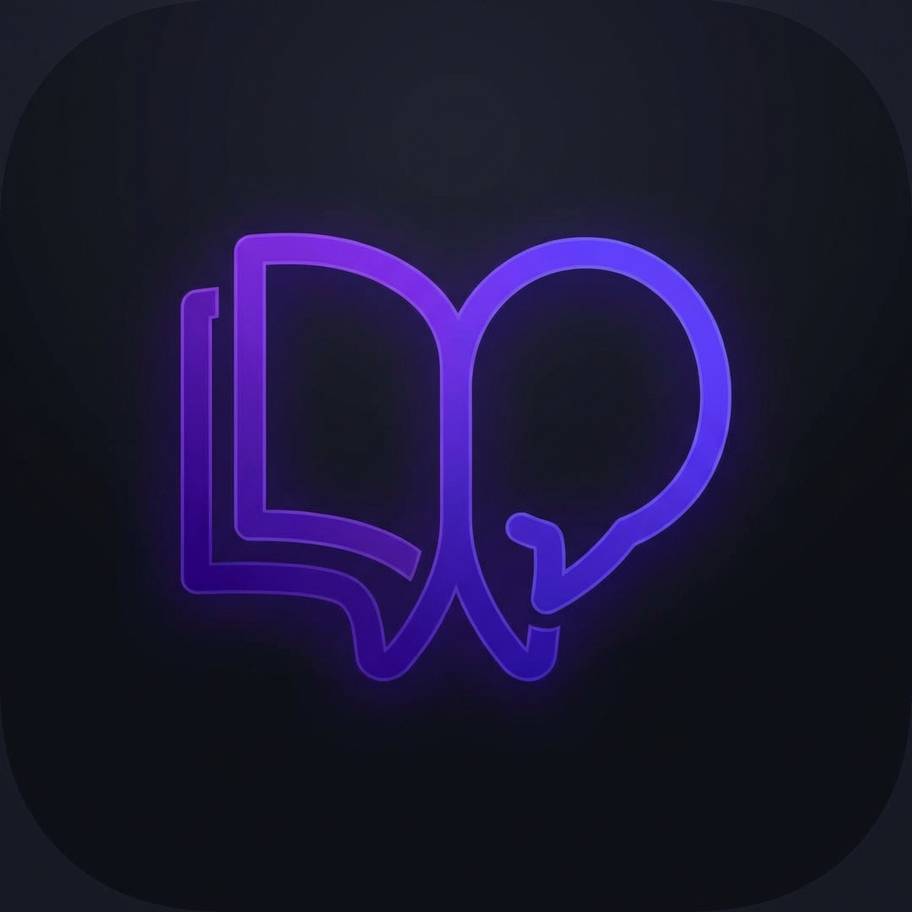

# WordApp - Vocabulary Learning Assistant 📚

WordApp is a modern and user-friendly Flutter application designed to help you improve your English
vocabulary. You can create your own word list, add stories and images to words, and track your
learning progress.

<p align="center">
  
</p>

## ✨ Features

- **Personalized List:** Add the specific words you want to learn.
- **Detailed Records:** Add Turkish meanings, word types (noun, verb, etc.), and mnemonic stories
  for each word.
- **Visual Memory:** Strengthen your visual memory by adding images from your device to your words.
- **Learning Tracking:** Monitor your progress by marking words as "Learned".
- **Local Storage:** Securely and quickly store your data on your device using the `Isar Database`.
- **Modern Interface:** A sleek and fluid user experience with Material 3 design.

## 🚀 Technologies Used

- **Framework:** [Flutter](https://flutter.dev)
- **Database:** [Isar](https://isar.dev) (High-performance NoSQL database)
- **Image Selection:** `image_picker`
- **File Management:** `path_provider`

## 🛠️ Installation

Follow these steps to run the project on your local machine:

1. **Clone the repository:**
   ```bash
   git clone https://github.com/Caferozsahin27/word_app.git
   ```

2. **Install dependencies:**
   ```bash
   flutter pub get
   ```

3. **Generate Isar code:**
   ```bash
   dart run build_runner build
   ```

4. **Run the application:**
   ```bash
   flutter run
   ```

*This project is being developed by [caferozsahin](https://github.com/Caferozsahin27).*
